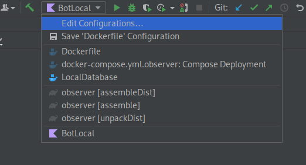

# Observer
Бот для администрирования дискорд сервера STALCRAFT.  
На данный момент бот умеет только помогать в тех. поддержку, 
но любые полезные фичи могут быть смержены в него и зарелижены прямиком 
сервер STALCRAFT

## Как запускать

Прежде всего понадобится установить Docker

Подразумевается, что вы разрабатываете в IntelliJ IDEA.  
В проекте уже имеются подготовленные run configurations.

LocalDatabase и BotLocal. Первая поднимет вам MariaDB вторая запустит бота.

Пожалуйста, перед запуском поменяйте следующие переменные среды:
 - BOT_TOKEN - токен дискорд бота
 - GUILD_ID - id сервера, на котором вы будете тестировать бота
 - SETTINGS_CHANNEL - id канала сервера, в котором вы будете настраивать бота

Бот настраивается через сообщения в канал. 

Например
```
command_prefix: e!
```
Установит `command_prefix` в значение `e!`

В одном сообщении можно установить не более одного значения.

Вы можете посмотреть как это работает вот тут `ru.justagod.observer.settings.SettingsManager`